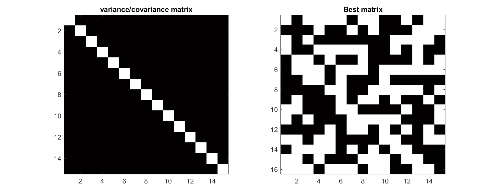
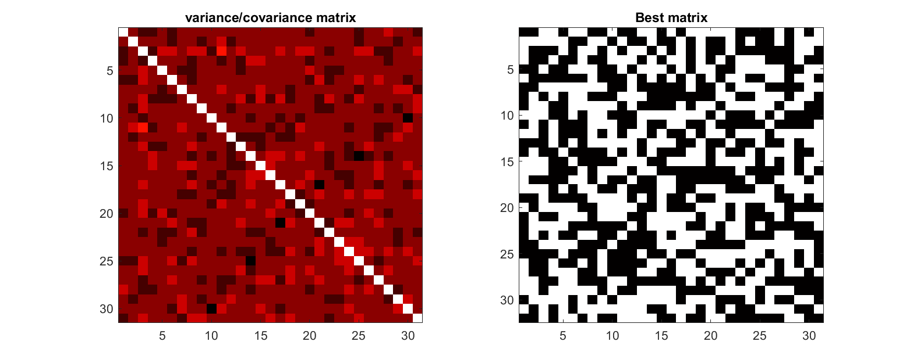

# Finding D-optimal designs without the pain for your DOE

This Matlab code is intended to find D-optimal and orthogonal designs from an unspecified number of independant parameters in order to design experimental campaigns. It's very easy to use: enter the number of experiments planned and the number of independant parameters of your study. The code will try to find an optimal design for these conditions. We mean by "optimal" the fact that the [variance/covariance matrix](https://en.wikipedia.org/wiki/Covariance_matrix) of the experiments has the maximal possible determinant while being [orthogonal](https://en.wikipedia.org/wiki/Orthogonal_matrix) at the same time. It is fully optimal when the extra-diagonal terms of the variance/covariance matrix are null and the diagonal terms equals. Other configurations are only sub-optimal but still usable with not much risks.

The code generally converges readily for variance/covariance matrix of order 16 and less. Up to 16 it converges to sub-optimal designs only. It can easily produce matrices with the same properties as [Hadamard matrices](https://en.wikipedia.org/wiki/Hadamard_matrix), [Plackett and Burman matrices](https://en.wikipedia.org/wiki/Plackett%E2%80%93Burman_design) or find [factorial designs](https://en.wikipedia.org/wiki/Factorial_experiment). It is limited to two-levels designs in its current version.

The code is a loose implementation of [this algorithm](Triefenbach%20(2008)%20The%20D-Optimal%20Approach%20and%20Its%20Implementation%20As%20a%20Computer%20Algorithm.pdf). It tries random substitution of +1/-1 from randomly generated matrices having the same number of +1 and -1 levels for each independant parameter.

## Example of a converged case, optimal design

## Example of a non-converged case, sub-optimal design

